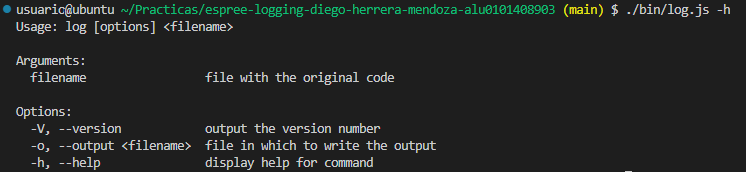

[](https://classroom.github.com/open-in-codespaces?assignment_repo_id=10290036)
# Práctica Espree logging

## Indicar los valores de los argumentos

Se ha modificado el código de `logging-espree.js` para que el log también indique los valores de los argumentos que se pasaron a la función. 
Ejemplo:

```javascript
function foo(a, b) {
  var x = 'blah';
  var y = (function (z) {
    return z+3;
  })(2);
}
foo(1, 'wut', 3);
```

```javascript
function foo(a, b) {
    console.log(`Entering foo(${ a }, ${ b })`);
    var x = 'blah';
    var y = function (z) {
        console.log(`Entering <anonymous function>(${ z })`);
        return z + 3;
    }(2);
}
foo(1, 'wut', 3);
```

## CLI con [Commander.js](https://www.npmjs.com/package/commander)

El programa admite la introducción de parametros por linea de comandos



## Reto 1: Soportar funciones flecha

Se ha modificado el código de `logging-espree.js` para que el log también se aplique a las funciones flecha.

```javascript
/**
 * @desc Adds logging to the input code.
 * @param {string} code The code to add logging to.
 * @returns The code with logging added.
 */
export function addLogging(code) {  
  const ast = espree.parse(code, { ecmaVersion: 6 }, { loc: true });
  estraverse.traverse(ast, {
    enter: function (node, parent) {
      if (node.type === 'FunctionDeclaration' ||
        node.type === 'FunctionExpression' || node.type === 'ArrowFunctionExpression') {
          addBeforeCode(node);
      }
    }
  });
  return escodegen.generate(ast);
}
```

## Reto 2: Añadir el número de línea

Se ha modificado el código de 'addBeforeCode' para que el log también indique el número de línea de la función.

```javascript
/**
 * @desc Adds a console.log statement before the function
 * @param {Object} node the function node
 */
function addBeforeCode(node) {
  let name = node.id ? node.id.name : '<anonymous function>';
  let lineNum = node.loc.start.line;
  let params = node.params.map(function (argumentos) {
    if (argumentos.type === 'Identifier') {
      return argumentos.name;
    }
    else if (argumentos.type === 'AssignmentPattern') {
      return argumentos.left.name + "=" + argumentos.right.name;
    }
    else if (argumentos.type === 'RestElement') {
      return "..." + argumentos.argument.name;
    }
  });
  params = params.join(', ');
  let beforeCode = `console.log(\`Entering ${name}(${params}) at line ${lineNum}\`);`;
  let beforeNodes = espree.parse(beforeCode, { ecmaVersion: 6 }).body;
  node.body.body = beforeNodes.concat(node.body.body);
}
```

## Tests and Covering

Se han añadido tests para comprobar que el programa funciona correctamente.

```javascript	
export default [
  {
    input: 'test1.js',
    output: 'logged1.js',
    correctLogged: 'correct-logged1.js',
    correctOut: 'logged-out1.txt'
  },
  {
    input: 'test2.js',
    output: 'logged2.js',
    correctLogged: 'correct-logged2.js',
    correctOut: 'logged-out2.txt'
  },
  {
    input: 'test3.js',
    output: 'logged3.js',
    correctLogged: 'correct-logged3.js',
    correctOut: 'logged-out3.txt'
  },
  {
    input: 'test4.js',
    output: 'logged4.js',
    correctLogged: 'correct-logged4.js',
    correctOut: 'logged-out4.txt'
  },
  {
    input: 'test5.js',
    output: 'logged5.js',
    correctLogged: 'correct-logged5.js',
    correctOut: 'logged-out5.txt'
  }
]
```

Se ha añadido el siguiente fragmento de código a los test para comprobar tanto el código generado como la salida del programa.

```javascript
for (let i = 0; i < Test.length; i++) {
  it(`addLogging(${Tst[i].input}, ${Tst[i].output})`, async () => {
    transpile(Test[i].input, Test[i].output);
    const output = await fs.readFile(Test[i].output, 'utf-8');
    const expected = await fs.readFile(Test[i].correctLogged, 'utf-8');
    assert.equal(removeSpaces(output), removeSpaces(expected));
    
    // Run the output program and check the logged output is what expected
    const logged = execSync(`node ${Test[i].output}`).toString();
    const expectedLogged = await fs.readFile(Test[i].correctOut, 'utf-8');
    assert.equal(removeSpaces(logged), removeSpaces(expectedLogged));
  });
}
```
Al ejecutar los test se obtiene el siguiente resultado:


Debido a que existe una incompatibilidad entre nyc y los módulos de ES6 no se puede realizar un correcto estudio de cobertura.


## GitHub Actions

Se ha hecho uso de la integración continua de GitHub Actions para comprobar que el programa funciona correctamente.
```yaml
# Write your workflow for CI here
name: CI
# Controls when the workflow will run
on:
  # Triggers the workflow on push or pull request events but only for the $default-branch branch
  push:
    branches: [ main ]
  pull_request:
    branches: [ main ]

  # Allows you to run this workflow manually from the Actions tab
  workflow_dispatch:

# A workflow run is made up of one or more jobs that can run sequentially or in parallel
jobs:
  # This workflow contains a single job called "build"
  build:
    # The type of runner that the job will run on
    runs-on: ubuntu-latest

    name: Test
    # Steps represent a sequence of tasks that will be executed as part of the job
    steps:
      # Checks-out your repository under $GITHUB_WORKSPACE, so your job can access it
      - uses: actions/checkout@v2
      - name: Test
        uses: actions/setup-node@v2
      - run: npm ci; npm test
```

